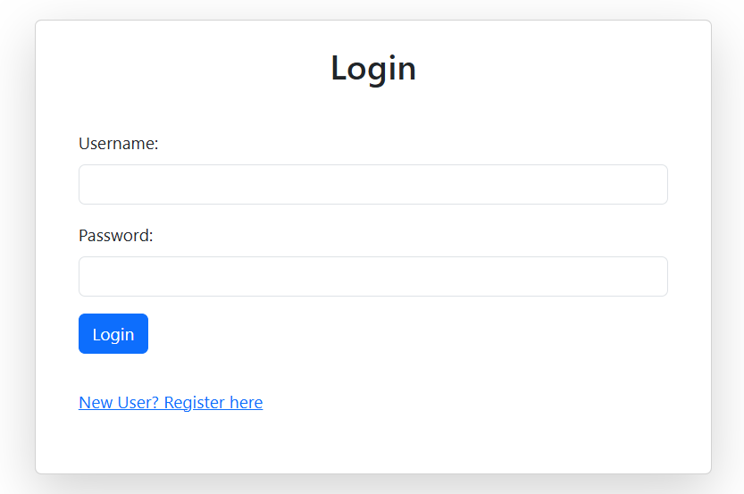
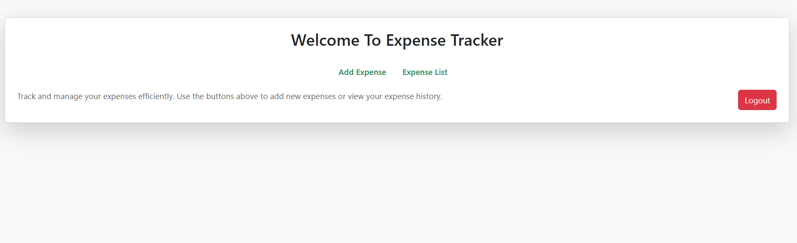
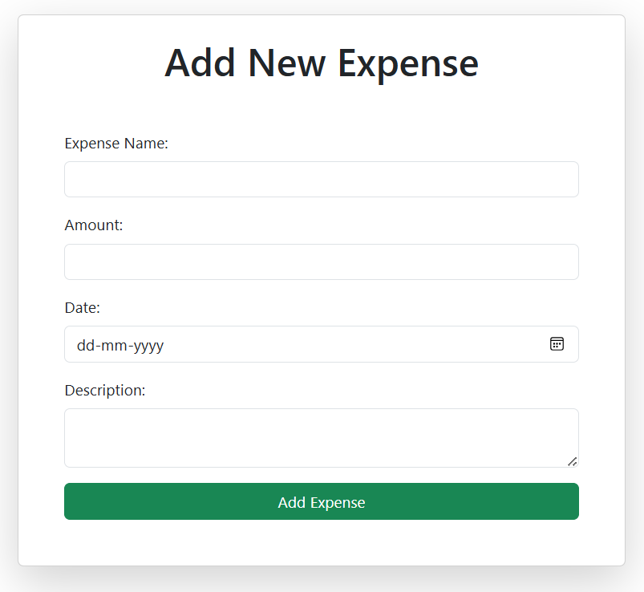
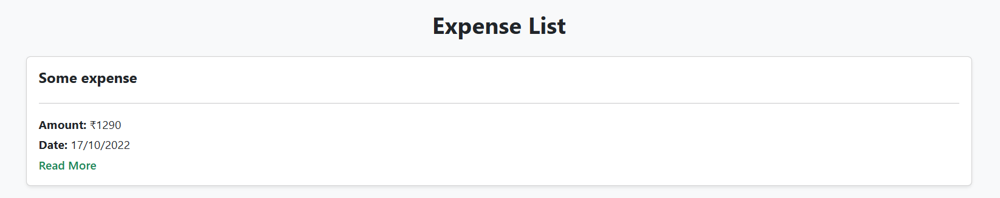
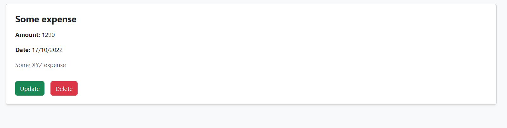
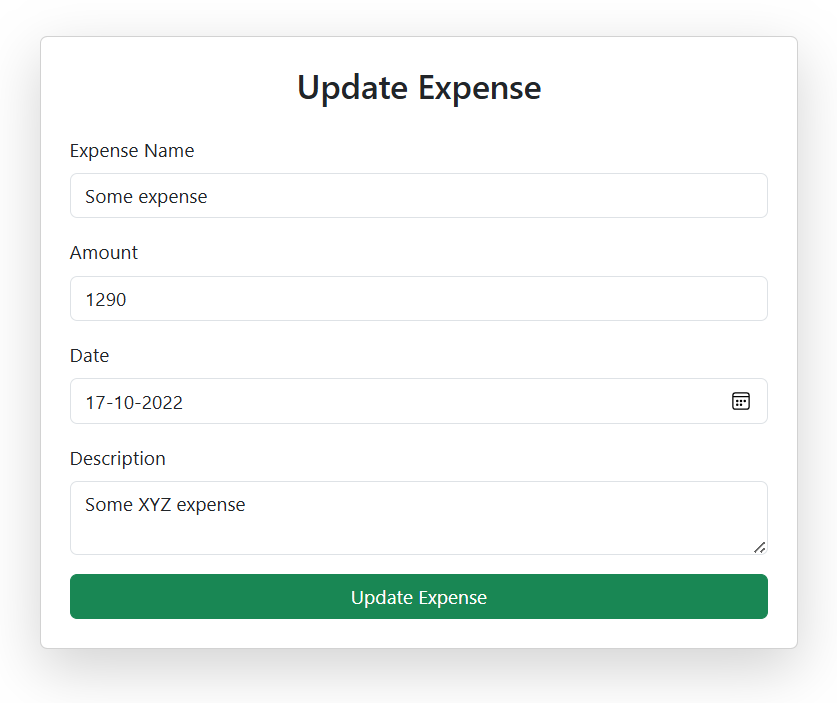

# Expense Tracker Frontend

A modern and responsive frontend application built with **React.js** and **Vite** for managing personal expenses. The application provides a secure and intuitive user interface for user authentication and expense management by integrating with the Expense Tracker Backend REST APIs.

---

## Live Demo

🌐 **Live Application:**  
https://expense-tracker-frontend-alpha-six.vercel.app/

---

## Features

- User Registration
- User Login
- Secure Authentication Flow
- Protected Routes
- Add Expense
- View All Expenses
- Update Expense
- Delete Expense
- Responsive User Interface
- REST API Integration
- Client-Side Routing using React Router
- Form Validation
- Error Handling

---

## Tech Stack

| Category | Technologies |
|----------|--------------|
| Frontend | React.js, Vite |
| Styling | CSS3, Bootstrap |
| Routing | React Router DOM |
| HTTP Client | Axios |
| Authentication | Backend JWT Integration using HTTP-Only Cookies |
| Build Tool | Vite |
| Deployment | Vercel |
| Version Control | Git, GitHub |

---

## Project Structure

```text
expense-tracker-frontend
│
├── public/
│
├── src/
│   ├── assets/
│   ├── components/
│   │   ├── AddExpense.jsx
│   │   ├── Home.jsx
│   │   ├── Login.jsx
│   │   ├── ProtectedRoute.jsx
│   │   ├── Register.jsx
│   │   ├── ShowExpense.jsx
│   │   └── UpdateExpense.jsx
│   │
│   ├── api.js
│   ├── App.jsx
│   ├── App.css
│   ├── index.css
│   └── main.jsx
│
├── .env.development
├── .env.production
├── .gitignore
├── index.html
├── package.json
├── package-lock.json
├── vite.config.js
├── vercel.json
└── README.md
```

---

## Application Workflow

1. User registers by creating a new account.
2. User logs in with valid credentials.
3. The backend authenticates the user and stores a JWT inside an HTTP-only cookie.
4. Axios sends the authentication cookie automatically using `withCredentials`.
5. Protected routes verify authentication through the backend.
6. Authenticated users can:
   - Add expenses
   - View expenses
   - Update expenses
   - Delete expenses

---

## Backend Integration

The frontend communicates with the Expense Tracker Backend through RESTful APIs.

### Backend Repository

https://github.com/AQUIB-IRFANI/Expense-Tracker-Backend-API

The backend provides:

- JWT-based Authentication
- HTTP-Only Cookie Authentication
- User Registration & Login APIs
- Expense CRUD APIs
- Authentication Middleware
- MongoDB Integration

---

## Installation

### Clone Repository

```bash
git clone https://github.com/AQUIB-IRFANI/Expense_Tracker_frontend.git
```

---

### Install Dependencies

```bash
npm install
```

---

### Configure Environment Variables

Create a `.env.development` file:

```env
VITE_API_URL=http://localhost:5000
```

For production:

```env
VITE_API_URL=https://your-backend-url.onrender.com
```

---

### Start Development Server

```bash
npm run dev
```

---

### Build for Production

```bash
npm run build
```

---

## Screenshots

### Registration Page

Users can create a new account by providing their basic details.


---

### Login Page

Users can securely log in using their registered credentials.



---

### Home Dashboard

The home page provides quick access to expense management features after successful authentication.



---

### Add Expense

Users can add a new expense by entering the required details.



---

### Expense List

Displays all expenses associated with the authenticated user.



---

### View Expense Details

Displays the complete details of a selected expense.



---

### Update Expense

Allows users to modify an existing expense.



---

## Key Learning Outcomes

Through this project, I gained practical experience in:

- Building Single Page Applications (SPA) with React.js
- Component-Based Architecture
- React Router for Client-Side Navigation
- Axios API Integration
- Secure Authentication Flow using Backend JWT Authentication
- HTTP-Only Cookie Based Authentication
- Protected Routes
- REST API Consumption
- Frontend and Backend Integration
- Form Validation
- Responsive UI Development
- Debugging and Error Handling
- Deploying React Applications using Vercel

---

## Future Enhancements

- Expense Categories
- Search and Filter Expenses
- Monthly Analytics Dashboard
- Charts and Reports
- Budget Planning
- User Profile Management
- Dark Mode
- Export Expenses to PDF/Excel
- Email Notifications

---

## Author

**Aquib Muzzammil Irfani**

📧 Email: maquib1710@gmail.com

🔗 LinkedIn: https://linkedin.com/in/aquib-irfani-422746253

💻 GitHub: https://github.com/AQUIB-IRFANI
